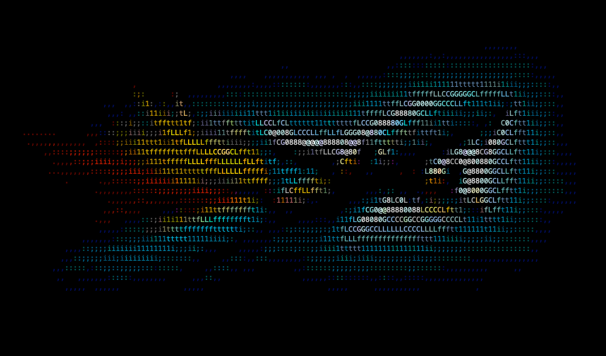
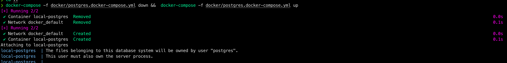
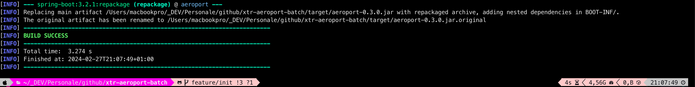
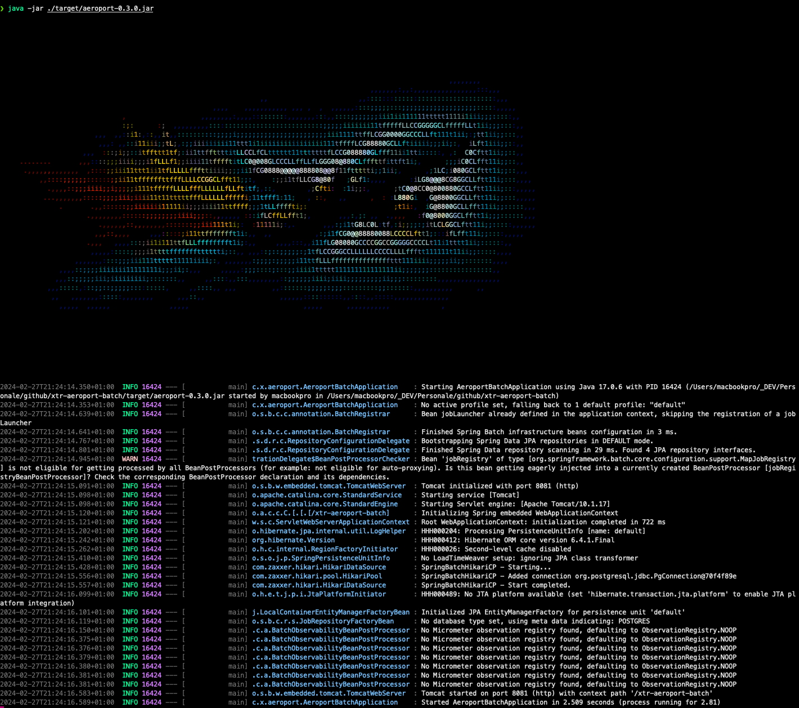
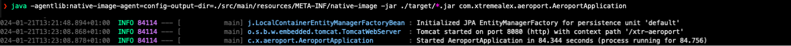
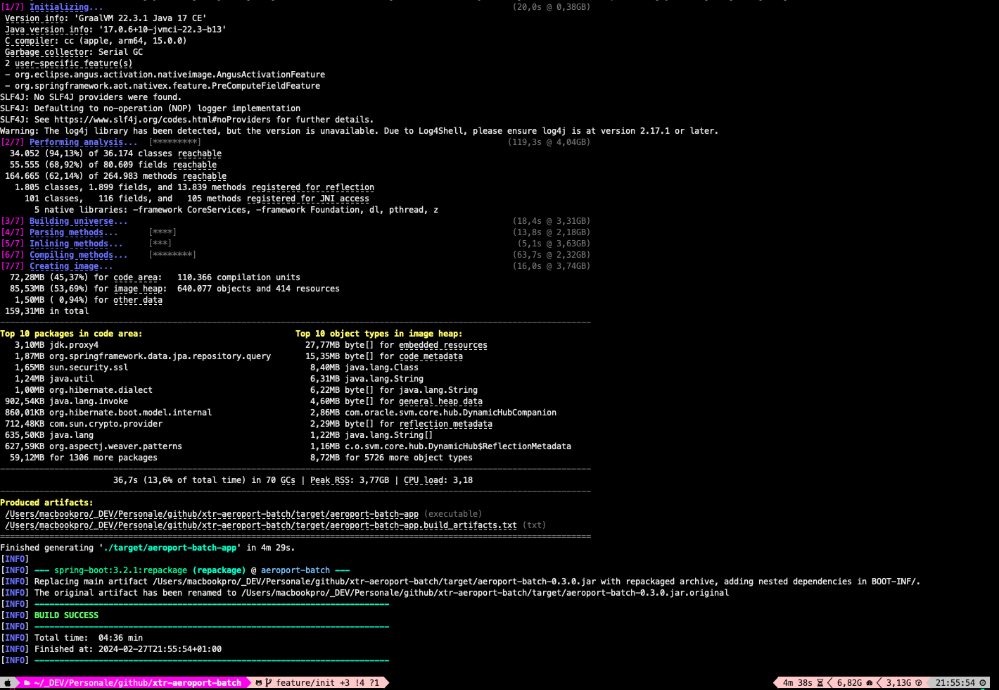
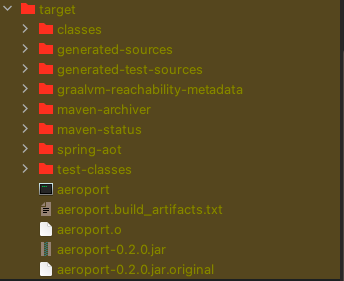
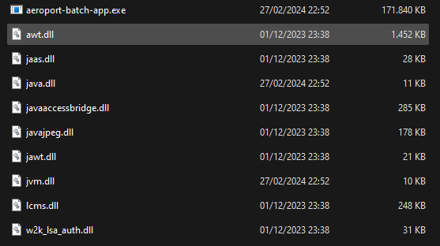
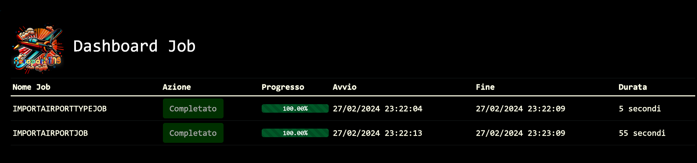
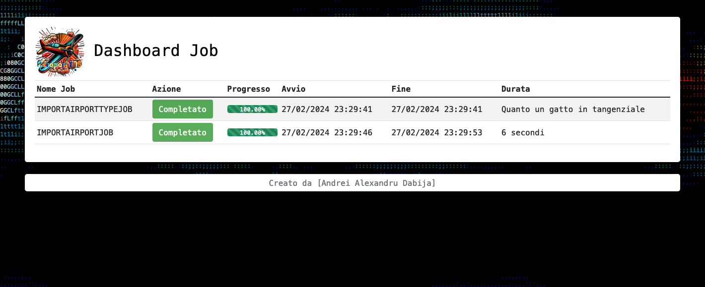

<a name="readme-top"></a>

<div align="center">
  
  <br /><br />
  
</div>

# xtr-aeroport-batch

Microservizio batch che importa dati di aeroporti e paesi da sorgenti JSON e li migra, in più step, verso una banca dati relazionale.

<details>
  <summary>Sommario</summary>
  <ol>
    <li><a href="#info-sul-progetto">Info sul progetto</a></li>
    <li><a href="#stack-tecnologico">Stack tecnologico</a></li>
    <li><a href="#getting-started">Getting Started</a></li>
    <li><a href="#play--test">Play &amp; Test</a></li>
    <li><a href="#roadmap">Roadmap</a></li>
    <li><a href="#come-contribuire">Come contribuire</a></li>
    <li><a href="#license">License</a></li>
    <li><a href="#contatti">Contatti</a></li>
    <li><a href="#ringraziamenti">Ringraziamenti</a></li>
  </ol>
</details>

## Info sul progetto

Questo progetto nasce come piattaforma sperimentale personale per mettere alla prova tecnologie e framework moderni in un contesto realistico. L'obiettivo è fornire una base solida e "enterprise like" per l'importazione batch di informazioni su aeroporti e rotte aeree verso un database relazionale.

È uno dei moduli di una serie più ampia, pensata per essere condivisa e arricchita con il contributo della community.

Fa parte della suite `xtr-aeroport-*`:

| Modulo | Ruolo |
|---|---|
| [`xtr-aeroport-ms`](https://github.com/XtremeAlex/xtr-aeroport-ms) | Microservizio di ricerca aeroporti |
| [`xtr-aeroport-batch`](https://github.com/XtremeAlex/xtr-aeroport-batch) | Import massivo dati (questo modulo) |
| [`xtr-aeroport-typological`](https://github.com/XtremeAlex/xtr-aeroport-typological) | Servizio dati tipologici |
| [`xtr-aeroport-common-lib`](https://github.com/XtremeAlex/xtr-aeroport-common-lib) | Libreria condivisa |
| [`xtr-aeroport-web-java`](https://github.com/XtremeAlex/xtr-aeroport-web-java) | Frontend web |

## Stack tecnologico

- Java 17 (GraalVM)
- Spring Boot 3.2.1 (Spring Batch, Data JPA, Actuator)
- PostgreSQL, HikariCP
- MapStruct, Lombok
- Micrometer + Prometheus, Grafana
- Docker, Helm / Kubernetes
- Linux, macOS, Windows

## Getting Started

Il progetto usa Maven per dipendenze e build. È sviluppato con Spring Boot 3 e Java 17 e può essere avviato e testato in locale.

### Prerequisiti

- Git (>= 2.43)
- GraalVM JDK 17 (per la build nativa) oppure un JDK 17 qualsiasi (per la build JVM)
- Maven (>= 3.9.6) — oppure il wrapper `./mvnw` incluso
- Docker (per il database e le build containerizzate)

### Coordinate del progetto

| Proprietà | Valore |
|---|---|
| groupId | `com.xtremealex` |
| artifactId | `aeroport-batch` |
| version | `0.3.0` |
| main class | `com.xtremealex.aeroport.AeroportBatchApplication` |
| context-path | `/xtr-aeroport-batch` |
| porta | `8081` |

### Clonare il repository

```bash
git clone https://github.com/XtremeAlex/xtr-aeroport-batch.git
cd xtr-aeroport-batch
```

### Avviare il database

```bash
docker-compose -f docker/postgres.docker-compose.yml down && \
docker-compose -f docker/postgres.docker-compose.yml up
```



### Build JVM

```bash
./mvnw clean package -DskipTests
java -jar ./target/aeroport-batch-0.3.0.jar
```



Poi apri il browser su: <http://localhost:8081/xtr-aeroport-batch/progress>



### Build nativa (GraalVM)

**1. Generare i metadati di reflection**

La native image lavora a closed-world: reflection, proxy, risorse e serializzazione dinamiche vanno dichiarate a build time. Il `native-image-agent` genera questi metadati eseguendo prima il jar sulla JVM ed esercitando i vari percorsi dell'applicazione.

```bash
java -agentlib:native-image-agent=config-output-dir=src/main/resources/META-INF/native-image \
  -jar ./target/aeroport-batch-0.3.0.jar
```

I file `.json` finiscono in `src/main/resources/META-INF/native-image/`; da qui il `native-maven-plugin` li rileva automaticamente, senza bisogno di `buildArg` espliciti.



**2. Compilare l'immagine nativa**

```bash
./mvnw package -DskipTests -Pnative
```



Il binario viene prodotto in `./target/aeroport-batch-app` (su Windows con estensione `.exe`).




**3. Avviare il binario nativo**

```bash
./target/aeroport-batch-app
```

**Note su ARM64 (Apple Silicon)**

Su Apple M1/M2 (Aarch64) quasi tutte le funzionalità GraalVM sono supportate, con alcune limitazioni ([riferimento GraalVM](https://www.graalvm.org/reference-manual/native-image/)):

- `WriteableCodeCache` deve essere disabilitato.
- `--libc=musl` non è supportato.
- Il Garbage Collector G1 non è supportato.

**Recap dei comandi**

```bash
./mvnw clean
./mvnw package -DskipTests
java -agentlib:native-image-agent=config-output-dir=src/main/resources/META-INF/native-image -jar ./target/aeroport-batch-0.3.0.jar
./mvnw package -DskipTests -Pnative
./target/aeroport-batch-app
```

### Build Docker

Build dell'immagine tramite buildpacks (profili per architettura):

```bash
# Apple Silicon (ARM64)
./mvnw package -DskipTests -Pdocker-m1-arm

# x86
./mvnw package -DskipTests -Pdocker-x86
```

Esecuzione del container:

```bash
docker run -p 8081:8081 artifactory.io/k8s-test/namespace/com.xtremealex/aeroport-batch:0.3.0
```


## Play & Test

- Dashboard job: <http://127.0.0.1:8081/xtr-aeroport-batch/progress>
- Metriche Prometheus: <http://127.0.0.1:8081/xtr-aeroport-batch/actuator/prometheus>

### Benchmark

- **Windows 11** (i7-10750H, 64 GB RAM)
  
- **macOS Sonoma 14.2.1** (M1 16 GB / M1 Max 64 GB RAM)
  

## Roadmap

- [x] Verticale batch AirportType
- [x] Verticale batch Airport
- [x] Controller REST
- [x] Dashboard HTML di avanzamento
- [x] Dockerfile e docker-compose per GraalVM JDK 17 (JVM, nativo macOS, nativo Windows)
- [ ] Profilo OpenJDK 17
- [ ] Suite di test e raccolta delle statistiche

Consulta le [open issues](https://github.com/XtremeAlex/xtr-aeroport-batch/issues) per l'elenco completo di feature proposte e bug noti.

## Come contribuire

I contributi sono ciò che rende la community open source un posto straordinario per imparare e creare. Ogni contributo è molto apprezzato.

1. Fai un fork del progetto
2. Crea il tuo feature branch (`git checkout -b feature/nome-feature`)
3. Fai commit delle modifiche (`git commit -m "Aggiunge nome-feature"`)
4. Fai push sul branch (`git push origin feature/nome-feature`)
5. Apri una Pull Request

Se hai un suggerimento, apri pure una issue con il tag appropriato. E non dimenticare di mettere una stella al progetto!

## License

Distribuito con doppia licenza: **GNU AGPL-3.0** (vedi [`LICENSE`](LICENSE)) per uso open source, e **licenza commerciale** per uso in prodotti proprietari (vedi [`COMMERCIAL-LICENSE.md`](COMMERCIAL-LICENSE.md)).

## Contatti

Andrei Alexandru Dabija — [LinkedIn](https://www.linkedin.com/in/andrei-alexandru-dabija/) — [github.com/XtremeAlex](https://github.com/XtremeAlex)

<p align="right">(<a href="#readme-top">back to top</a>)</p>

## Ringraziamenti

- [Spring Boot](https://spring.io/projects/spring-boot) e [Spring Batch](https://spring.io/projects/spring-batch)
- [GraalVM](https://www.graalvm.org/) per la compilazione nativa
- [Micrometer](https://micrometer.io/) + [Prometheus](https://prometheus.io/) e [Grafana](https://grafana.com/) per l'osservabilità
- [Best-README-Template](https://github.com/othneildrew/Best-README-Template) come ispirazione per la struttura

<p align="right">(<a href="#readme-top">back to top</a>)</p>
